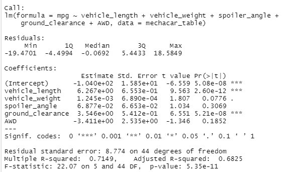
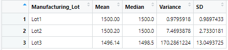
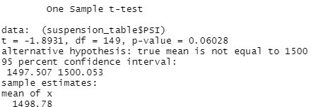

# MechaCar_Statistical_Analysis
Statistical tests designed to evaluate the prototype MechaCar

## Linear Regression to Predict MPG

According to the linear regression test, vehicle length and ground clearance appear to be significantly correlated with fuel efficiency. With an r-squared value of 0.71, we can safely say that the slope of the linear model is non-zero. Although a few variables seem to be significant, the model may not be able to accurately predict the miles-per-gallon of the MechaCar, because the intercept's p-value is also significant. This can be evidence of a need to manipulate the data to more evenly distributed.

## Summary Statistics on Suspension Coils

The above table provides summary statistics for the PSI of the MechaCar across all manufacturing lots. The mean and median are in line with the wider standard across other types of cars.

Here is the same table broken down by manufacturing lot. The variance for lot 3 clearly exceeds the 100 PSI variance as outlined in the design specifications for the MechaCar.

## T-Tests on Suspension Coils
The average PSI in these lots seems to be insignificant when compared to the population average of 1500 as indicated by the p-value of 0.06.

A breakdown of comparisons by lot number yield the same p-value across all lots.

## Study Design: MechaCar vs Competition
An appropriate measure of the overall quality of the MechaCar would be to compare the average difference between the initial cost and resale value using an ANOVA test.  To perform this test we would need the data on the prices of new cars of a similar type and the depreciation over a fixed number of years. The ANOVA test would allow us to compare this difference between multiple samples of this data. The null hypothesis would assume that any difference in this average value would be due to randomness, but a rejection would imply a correlation.  If the Pr(>F) value of the ANOVA test measured less than 0.05 then the null hypothesis would be rejected.